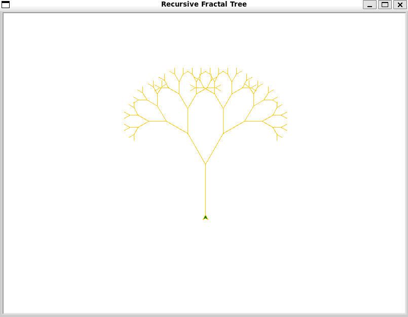

# 🌳 Recursive Artistry Program

An interactive Python application showcasing the power of **functions** and **recursion**.  
Explore factorials, Fibonacci numbers, and draw a stunning fractal tree with Turtle graphics.

---

## 📋 Contents

- [Overview](#-overview)  
- [Prerequisites](#-prerequisites)  
- [Installation](#-installation)  
- [Usage](#-usage)  
- [Features](#-features)  
- [Code Walkthrough](#-code-walkthrough)  
- [Example Runs](#example-runs)  
- [Fractal Tree Image](#fractal-tree-image)  
- [Author](#author)  

---

## 🔍 Overview

The **Recursive Artistry Program** offers a menu-driven interface to:
1. Calculate the factorial of a non-negative integer.  
2. Compute the nth Fibonacci number.  
3. Draw a recursive fractal tree using Turtle graphics.  
4. Exit the program.

---

## ⚙️ Prerequisites

- **Python 3.x**  
- **tkinter** library (for Turtle graphics)  
- A terminal or command prompt

---

## 🛠 Installation

1. Clone or download the repository.  
2. Ensure `tkinter` is installed:
   ```bash
   # Debian/Ubuntu
   sudo apt update && sudo apt install python3-tk

   # Fedora/RHEL
   sudo dnf install python3-tkinter
   ```

---

## 🚀 Usage

1. Navigate to the project directory.  
2. Run the script:
   ```bash
   python recursive_artistry.py
   ```
3. Select an option from the menu by entering **1**, **2**, **3**, or **4**.

---

## ⭐ Features

- **Factorial**: Recursive calculation with input validation.  
- **Fibonacci**: Recursive sequence generator.  
- **Fractal Tree**: Uses Turtle to draw a fractal tree pattern.  
- **User-Friendly**: Clear prompts, error handling, and looped menu.

---

## 📝 Code Walkthrough

```python
import sys
import turtle

def factorial(n):
    # Recursively compute n! with error checks
    ...

def fibonacci(n):
    # Recursively compute the nth Fibonacci number
    ...

def draw_fractal(branch_len, t):
    # Recursive function to draw a fractal tree
    ...

def prompt_positive_integer(prompt):
    # Loop until user enters a valid non-negative integer
    ...

def main():
    # Menu loop: factorial, Fibonacci, fractal, exit
    ...
```

---

## 📂 Example Runs

\`\`\`text
Welcome to the Recursive Artistry Program!

Please choose an option:
  1. Calculate Factorial
  2. Find Fibonacci Number
  3. Draw a Recursive Fractal (requires turtle)
  4. Exit

Enter your choice (1-4): 1
Enter a non-negative integer for factorial: 5
The factorial of 5 is 120.

Enter your choice (1-4): 2
Enter a non-negative integer for Fibonacci: 7
The 7th Fibonacci number is 13.

Enter your choice (1-4): 4
Goodbye! Thanks for exploring recursion.
\`\`\`

---

## Fractal Tree Image

Insert your fractal tree screenshot or diagram here:

\`\`\`markdown

\`\`\`

Place your image file in the repository and update the path above.

---

